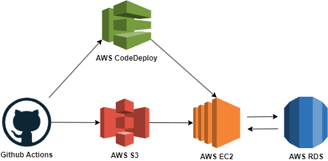
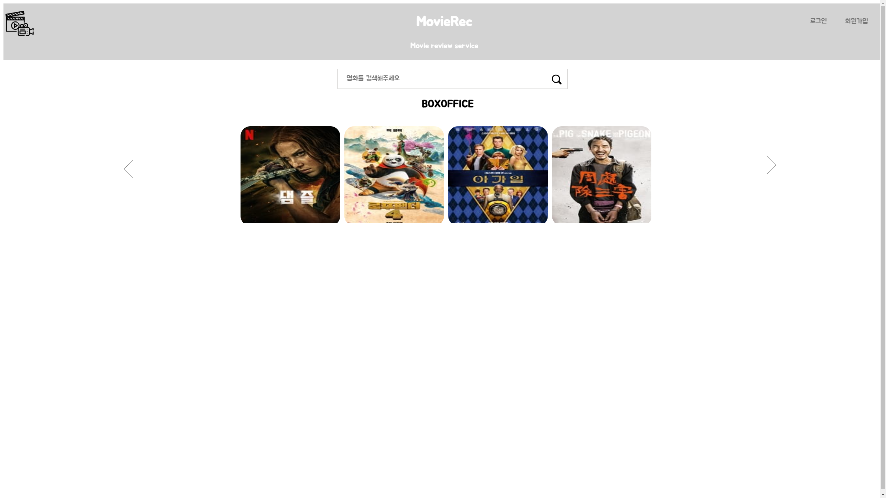
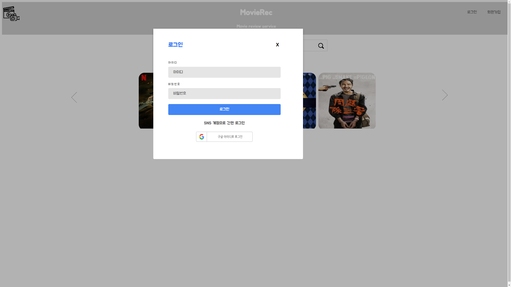
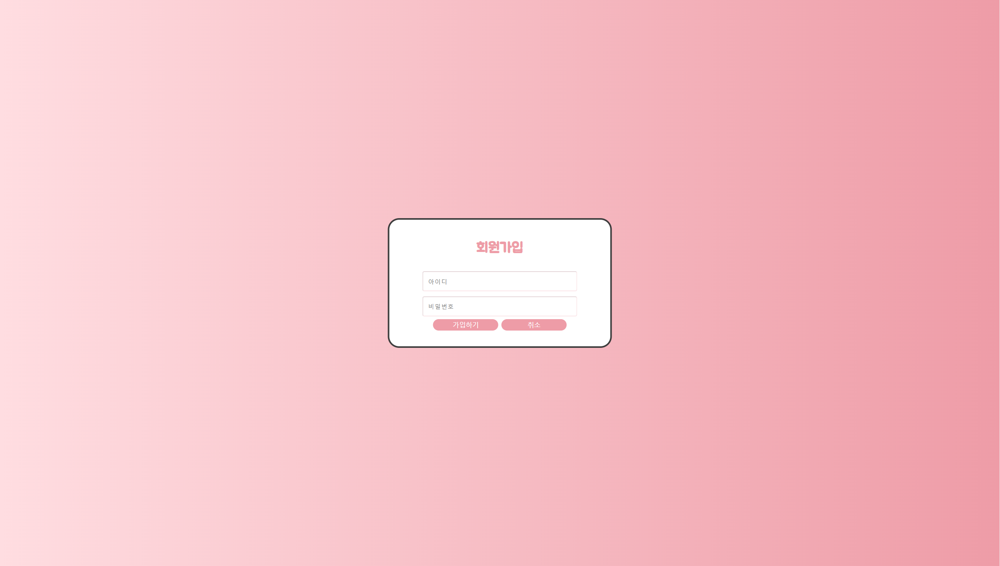
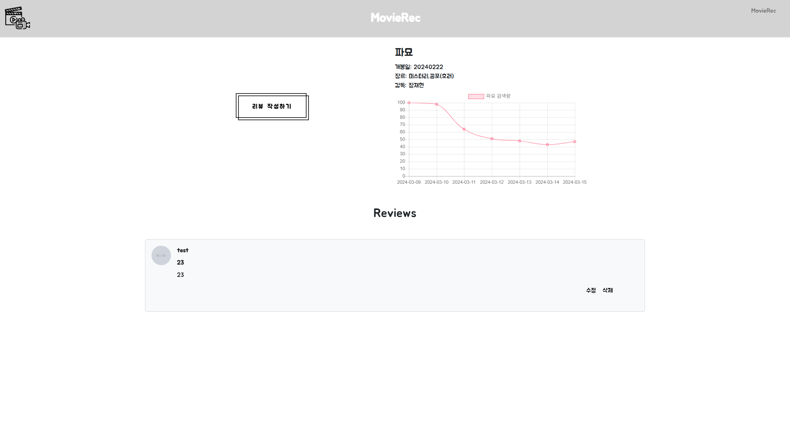
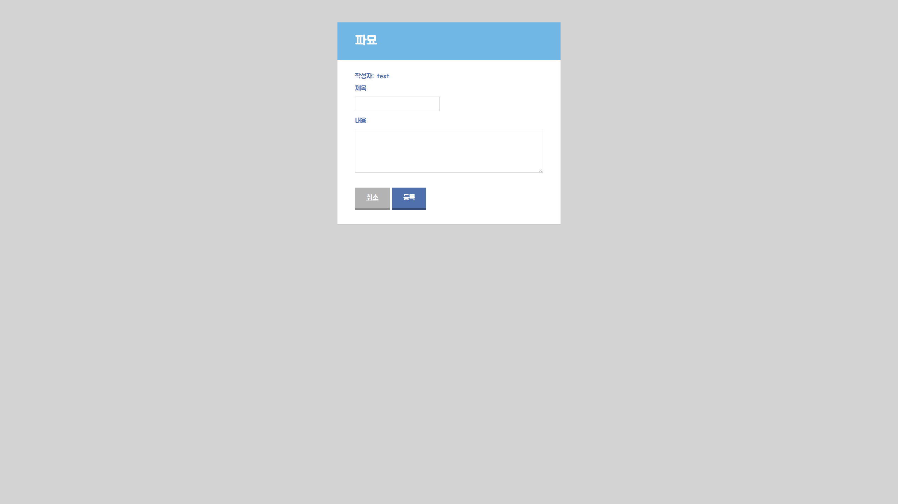
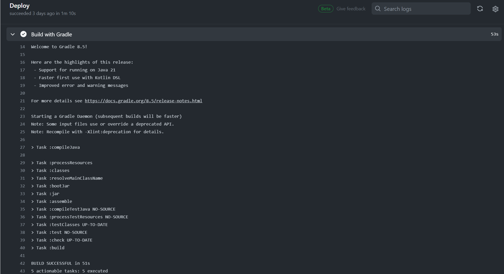

# MovieREC

    
    
    
    
    
    

## 📃프로젝트 소개

영화 검색 및 정보, 리뷰 작성 서비스를 제공하는 Spring 기반의 웹 어플리케이션입니다. 

### 🔧  Service Architecture

------

## 🎞 화면 구성

- 메인 페이지

  

- 로그인

  

- 회원가입

  

- 영화 정보

  

- 리뷰 작성

  

## 💻 문제 해결

- InstanceAgetn::Plugins::CodeDeployPlugin::Commandpoller: Calling putHostCommandComplete: "Code Error"
  - yml 파일이 gitignore 에 설정 되어있어 파일이 안올라갔던 문제로 gitignore 수정하여 해결

- Github Actions 을 통해 진행하는 CD 프로세스 중 빌드하는 과정에서 jar 파일이 2개 생성되는 현상
  - build.gradle 파일에 jar { enabled = false } 코드를 추가하여 plain.jar 파일이 생성되지 않게 함

  
